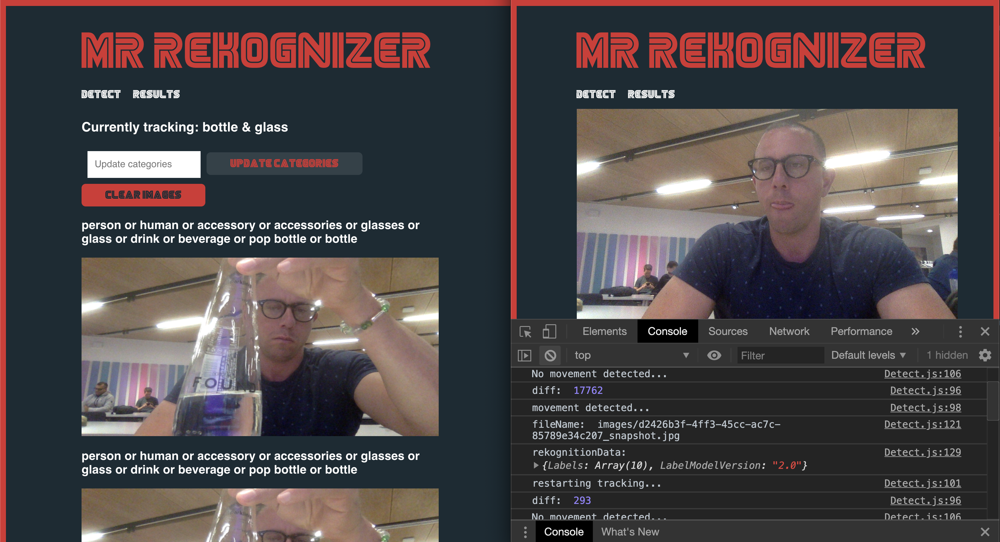

## Real-time image recognition



### What is this?

This app will allow you to set a tracker on the types of items you'd like to detect. It will then check for movement, detect the item in the picture, and if the item is on the list of items being tracked, will display the image in an image feed.

### Tools

- React
- AWS Amplify
- AWS AppSync
- Amazon Cognito
- Amazon Rekognition
- React Router
- AWS Lambda

### GraphQL schema

```graphql
type ImageData @model
  @auth(rules: [
    { allow: public },
    { allow: private }
    ])
{
  id: ID!
  imageKey: String
  rekognitionData: String
  imageTypes: [String]
}

type Query {
	process(imageKey: String!): ImageData @function(name: "rekognitionfunction-${env}")
}
```

### Lambda function:

```javascript
const AWS = require('aws-sdk')
AWS.config.update({region: 'us-east-2'})
const rekognition = new AWS.Rekognition()
const axios = require('axios')
const gql = require('graphql-tag')
const graphql = require('graphql')
const { print } = graphql
const uuid = require('uuid/v4')

const saveData = gql`mutation CreateImageData($input: CreateImageDataInput!) {
  createImageData(input: $input) {
    id
    imageKey
    rekognitionData
  }
}`;

exports.handler = function (event, context) { //eslint-disable-line
  var params = {
    Image: {
      S3Object: {
        Bucket: "rtrekognitionstorage-10-05-2019-dev", 
        Name: "public/" + event.arguments.imageKey
      }
    }, 
    MaxLabels: 10, 
    MinConfidence: 70
  };

  rekognition.detectLabels(params, function(err, data) {
    if (err) {
      context.done(err)
    } else {
      const rekognitionData = JSON.stringify(data)
      axios({
        url: process.env.APPSYNC_ENDPOINT,
        method: 'post',
        headers: {
          'x-api-key': process.env.APPSYNC_KEY
        },
        data: {
          query: print(saveData),
          variables: {
            input: {
              imageKey: event.arguments.imageKey,
              rekognitionData
            }
          }
        }
      })
      .then(successData => {
        const { id, imageKey, rekognitionData } = successData.data.data.createImageData
        const graphqlData = {
          id,
          imageKey,
          rekognitionData
        }
        context.done(null, graphqlData)
      })
      .catch(err => context.done(err))
    }
  })
}
```
